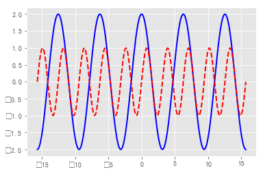
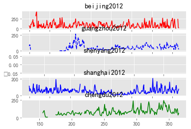

# python-数据可视化

#### 班级:2017211314
#### 学号:2017213508
#### 姓名:蒋雪枫


```python
import matplotlib
import matplotlib.pyplot as plt
```


```python
plt.style.use('ggplot')
# matplotlib.rcParams['font.sans-serif'] = ['SimHei']
#可以用plt.style.available命令查看所有可用的风格。例如有'bmh'、'dark_background'、'seaborn-dark‘等风格。
```

以下是测试构图:


```python
min,max=-100,100
fig=plt.figure() #创建图像
ax=plt.axes() #创建坐标轴对象
fig,ax=plt.subplots() #同时创建出图像和坐标轴的实例
ax.set_xlim(min,max) #设置x轴上下限
ax.set_ylim(min,max) #设置y轴上下限
ax.set_title("axes Graph")
ax.set_xlabel("X axis") #设置x轴上的标签
ax.set_ylabel("Y axis") #设置y轴上的标签
ax.text(50,50,"center") #在(x,y)坐标处添加文字串s
#添加注释
# ax.annotate("annotation",xy=(1,2),xycoords='axes fraction',xytext=(2,3),
# textcoords='axes fraction',arrowprops=dict(arrowstyle="->"))
# ax.legend([line1,line2,line3],["label1","label2","label3"],loc=‘lower right')
ax.spines["top"].set_visible(False) #隐藏上边框
# ax.set_xticks([ ]) #隐藏x轴刻度和刻度值
# ax.xaxis.set_major_formatter( plt.NullFormatter() ) #只需隐藏刻度值，同时保留刻度
#同理，隐藏下边框、左边框和右边框的参数分别为"bottom"、" left "、"right"。
plt.show()
```


- 设置刻度和刻度标签
```
ax.set_xticks([1,2,3]) #设置x轴刻度为1,2,3
ax.set_yticks([1,2,3]) #设置y轴刻度为1,2,3
ax.set_xticklabels(["one","two","three"]) #设置x轴刻度标签为one,two,three
ax.set_yticklabels(["one","two","three"]) #设置y轴刻度标签为one,two,three
```
- 添加子图
```
ax1=fig.add_axes([left, bottom, width, height]) # [left, bottom, width, height]用来设置新坐标轴的位置和大小
```
- 创建多个图像
```
fig,ax=plt.subplots(num_of_rows,num_of_columns,sharex=True,sharey=True) 
#创建出几行几列的网格图，可以用ax[0].plot()，ax[1].plot()等相继在各网格
上画图。
ax1 = fig.add_subplot(121)
ax2 = fig.add_subplot(122)
```
- 保存
```
fig.savefig('file_name.png') #将图像保存到当前文件夹的file_name.png
文件之中
```
- 展示
plt.show()
在一个python进程中只能使用一次plt.show()，因此通常把此命令放在程序的最后，等所有参数全部设置完毕后再显示图像。

### 作业一:


```python
# 已经把图片风格换成ggplot plt.style.use('ggplot')
import numpy as np
fig,ax=plt.subplots()
ax.set_title("square numbers")
x=np.linspace(-10,11,num=21,endpoint=False)
y=x**3
plt.bar(x,y,color='b') #bar的颜色改为蓝色
for a,b in zip(x,y): #在直方图上显示数字
    if(a<0):
        plt.text(a,b+0.2,'%d'%b,ha = 'center',va = 'bottom',fontsize=10)
    else:
        plt.text(a,b-100,'%d'%b,ha = 'center',va = 'bottom',fontsize=10)
plt.show()
```


### 作业二:


```python
#生成随机数
a = np.random.randint(1,1000,size=(1,10000))
a=a.tolist()[0]
len(a)
```


    10000


```python
scoresDic={}
for each in a:
    scoresDic[each]=scoresDic.get(each,0)+1
plt.axis([0,1000,0,30])
plt.bar(scoresDic.keys(),scoresDic.values(),0.5,alpha=0.5,color='b')
plt.show()
```


```python
#每五分为一个分数段
a = np.random.randint(1,1000,size=(1,10000))/5
a=a.tolist()[0]
scoresDics={}
for each in a:
    scoresDics[each]=scoresDics.get(each,0)+1
plt.axis([0,200,0,30])
plt.bar(scoresDics.keys(),scoresDics.values(),0.5,alpha=0.5,color='b')
plt.xticks([])
plt.show()
```


### 作业三


```python
import random
fig,ax=plt.subplots()
plt.rcParams['font.sans-serif']=['SimHei']
Semester1=[0]*10
Semester2=[0]*10
Semester3=[0]*10
#每学期排名随机生成
for i in range(0,len(Semester1)):
    Semester1[i]=random.randint(1,201)
for i in range(0,len(Semester2)):
    Semester2[i]=random.randint(1,201)
for i in range(0,len(Semester3)):
    Semester3[i]=random.randint(1,201)

x=np.arange(1,11) #生成横轴数据
plt.bar(x,Semester1,0.3,alpha=0.5,color='r')
plt.bar(x+0.3,Semester2,0.3,alpha=0.5,color='g')
plt.bar(x+0.6,Semester3,0.3,alpha=0.5,color='b')
#生成上学期的排名直方图，在上一个直方图的右侧0.3的距离显示
for a,b in zip(x,Semester1): #在直方图上显示本学期的排名数字
    plt.text(a,b+0.2,'%d'%b,ha = 'center',va = 'bottom',fontsize=10)
for a,b in zip(x,Semester2): #在直方图上显示上学期的排名数字
    plt.text(a+0.3,b+0.2,'%d'%b,ha = 'center',va = 'bottom',fontsize=10)
for a,b in zip(x,Semester3): #在直方图上显示上学期的排名数字
    plt.text(a+0.6,b+0.2,'%d'%b,ha = 'center',va = 'bottom',fontsize=10)
plt.grid(True, linestyle='--', alpha=0.8) #设置网格线
plt.title("Three Semester Score")
plt.show()

```


### 作业四


```python
#demo1405:
x = np.linspace(-1, 15, 7) #在-1到10的区间内生成20个数据
y1 = 80* x + 11 #直线 y1
y2 = 2**x+5 #曲线 y2
plt.plot(x, y1, 'r+',color="red", linewidth=1.0, linestyle="-", label='line1')
# 绘制颜色为蓝色、宽度为 1 像素的连续直线 y1，数据点为+号形式
plt.plot(x, y2, 'bo', color="#800080", linewidth=2.0, linestyle="--", label='line2')
# 绘制颜色为紫色、宽度为 2 像素的不连续曲线 y2,数据点为圆点形式
plt.xlim(-2,17) # 设置横轴的最大最小值
ax.legend(["y=80x+11","y=2^x+5"],loc='upper left') #在左上角显示图例
plt.show()
```


### 作业五


```python
Pi=3.14159
x=np.linspace(-5*Pi,5*Pi,200)
fig,ax=plt.subplots()
cos,sin=2*np.cos(x),np.sin(2*x)
# ax.set_xticks( [-2*np.pi, -1*np.pi, 0, np.pi, 2*np.pi]) #设置x轴的刻度
plt.plot(x, cos, color="blue", linewidth=2, linestyle="-", label="cos")
#画出cos曲线，颜色为蓝色，线宽为2，连续线
plt.plot(x, sin, color="red", linewidth=2, linestyle="--", label="sin")
#画出sin曲线，颜色为红色，线宽为2，间断线
```


    [<matplotlib.lines.Line2D at 0x2d5b52bb748>]





### 作业六
前面几年数据有缺失,后面几年数据比较正常,同时在这里严禁来说需要考虑到闰年还是平年,不过对整体图像影响不大,故不加处理了


```python
import pandas as pd
df_beijing = pd.read_csv("dataset/BeijingPM20100101_20151231.csv",encoding='utf-8')
df_guangzhou = pd.read_csv("dataset/GuangzhouPM20100101_20151231.csv",encoding='utf-8')
df_shenyang =  pd.read_csv("dataset/ShenyangPM20100101_20151231.csv",encoding='utf-8')
df_shanghai =  pd.read_csv("dataset/ShanghaiPM20100101_20151231.csv",encoding='utf-8')
df_chengdu =  pd.read_csv("dataset/ChengduPM20100101_20151231.csv",encoding='utf-8')
dfs = [df_beijing,df_guangzhou,df_shenyang,df_shanghai,df_chengdu]
cols=[['PM_Dongsi','PM_Dongsihuan','PM_Nongzhanguan','PM_US Post'], ["PM_City Station","PM_5th Middle School","PM_US Post"],
      ["PM_Taiyuanjie","PM_US Post","PM_Xiaoheyan"],["PM_Jingan","PM_US Post","PM_Xuhui"],
      ["PM_Caotangsi","PM_Shahepu","PM_US Post"]]
time = ["year","month","day"]
for i in range(len(dfs)):
    dfs[i] = dfs[i].groupby(time).mean().loc[:,cols[i]].apply(lambda x:x.mean(), axis=1)
#     print(dfs[i].head())
    dfs[i]=dfs[i].tolist()
# print(type(dfs[0]))
# print(type(dfs[4][0]))
# print(dfs[4][0])
# print(math.isnan(dfs[4][0]))

timeLine=np.linspace(0,365,365).tolist()
print(type(timeLine))

plt.figure(1)
plt.title("2010 yaer")
ax1=plt.subplot(5,1,1)
ax2=plt.subplot(5,1,2)
ax3=plt.subplot(5,1,3)
ax4=plt.subplot(5,1,4)
ax5=plt.subplot(5,1,5)
plt.sca(ax1)
plt.plot(timeLine,dfs[0][:365],color='red')
plt.title("beijing2010")

plt.sca(ax2)
plt.plot(timeLine,dfs[1][:365],'b--')
plt.title("guangzhou2010")

plt.sca(ax3)
plt.plot(timeLine,dfs[2][:365],'g--')
plt.title("shenyang2010")

plt.sca(ax4)
plt.plot(timeLine,dfs[3][:365],color='blue')
plt.title("shanghai2010")

plt.sca(ax5)
plt.plot(timeLine,dfs[4][:365],color='green')
plt.title("chengdu2010")
plt.show()
```

    <class 'list'>
    


```python
plt.figure(1)
plt.title("2010 yaer")
ax1=plt.subplot(5,1,1)
ax2=plt.subplot(5,1,2)
ax3=plt.subplot(5,1,3)
ax4=plt.subplot(5,1,4)
ax5=plt.subplot(5,1,5)
plt.sca(ax1)
plt.plot(timeLine,dfs[0][365:730],color='red')
plt.title("beijing2011")

plt.sca(ax2)
plt.plot(timeLine,dfs[1][365:730],'b--')
plt.title("guangzhou2011")

plt.sca(ax3)
plt.plot(timeLine,dfs[2][365:730],'g--')
plt.title("shenyang2011")

plt.sca(ax4)
plt.plot(timeLine,dfs[3][365:730],color='blue')
plt.title("shanghai2011")

plt.sca(ax5)
plt.plot(timeLine,dfs[4][365:730],color='green')
plt.title("chengdu2011")
plt.show()
```


```python
plt.figure(1)
plt.title("2010 yaer")
ax1=plt.subplot(5,1,1)
ax2=plt.subplot(5,1,2)
ax3=plt.subplot(5,1,3)
ax4=plt.subplot(5,1,4)
ax5=plt.subplot(5,1,5)
plt.sca(ax1)
plt.plot(timeLine,dfs[0][730:1095],color='red')
plt.title("beijing2012")

plt.sca(ax2)
plt.plot(timeLine,dfs[1][730:1095],'b--')
plt.title("guangzhou2012")

plt.sca(ax3)
plt.plot(timeLine,dfs[2][730:1095],'g--')
plt.title("shenyang2012")

plt.sca(ax4)
plt.plot(timeLine,dfs[3][730:1095],color='blue')
plt.title("shanghai2012")

plt.sca(ax5)
plt.plot(timeLine,dfs[4][730:1095],color='green')
plt.title("chengdu2012")
plt.show()
```





```python
plt.figure(1)
plt.title("2010 yaer")
ax1=plt.subplot(5,1,1)
ax2=plt.subplot(5,1,2)
ax3=plt.subplot(5,1,3)
ax4=plt.subplot(5,1,4)
ax5=plt.subplot(5,1,5)
plt.sca(ax1)
plt.plot(timeLine,dfs[0][1095:1460],color='red')
plt.title("beijing2013")

plt.sca(ax2)
plt.plot(timeLine,dfs[1][1095:1460],'b--')
plt.title("guangzhou2013")

plt.sca(ax3)
plt.plot(timeLine,dfs[2][1095:1460],'g--')
plt.title("shenyang2013")

plt.sca(ax4)
plt.plot(timeLine,dfs[3][1095:1460],color='blue')
plt.title("shanghai2013")

plt.sca(ax5)
plt.plot(timeLine,dfs[4][1095:1460],color='green')
plt.title("chengdu2013")
plt.show()
```


```python
plt.figure(1)
plt.title("2010 yaer")
ax1=plt.subplot(5,1,1)
ax2=plt.subplot(5,1,2)
ax3=plt.subplot(5,1,3)
ax4=plt.subplot(5,1,4)
ax5=plt.subplot(5,1,5)
plt.sca(ax1)
plt.plot(timeLine,dfs[0][1460:1825],color='red')
plt.title("beijing2014")

plt.sca(ax2)
plt.plot(timeLine,dfs[1][1460:1825],'b--')
plt.title("guangzhou2014")

plt.sca(ax3)
plt.plot(timeLine,dfs[2][1460:1825],'g--')
plt.title("shenyang2014")

plt.sca(ax4)
plt.plot(timeLine,dfs[3][1460:1825],color='blue')
plt.title("shanghai2014")

plt.sca(ax5)
plt.plot(timeLine,dfs[4][1460:1825],color='green')
plt.title("chengdu2014")
plt.show()
```


```python
plt.figure(1)
plt.title("2010 yaer")
ax1=plt.subplot(5,1,1)
ax2=plt.subplot(5,1,2)
ax3=plt.subplot(5,1,3)
ax4=plt.subplot(5,1,4)
ax5=plt.subplot(5,1,5)
plt.sca(ax1)
plt.plot(timeLine,dfs[0][1825:2190],color='red')
plt.title("beijing2015")

plt.sca(ax2)
plt.plot(timeLine,dfs[1][1825:2190],'b--')
plt.title("guangzhou2015")

plt.sca(ax3)
plt.plot(timeLine,dfs[2][1825:2190],'g--')
plt.title("shenyang2015")

plt.sca(ax4)
plt.plot(timeLine,dfs[3][1825:2190],color='blue')
plt.title("shanghai2015")

plt.sca(ax5)
plt.plot(timeLine,dfs[4][1825:2190],color='green')
plt.title("chengdu2015")
plt.show()
```


### 作业七


```python
fig,ax=plt.subplots()
# 读取数据
iris = pd.read_csv( 'iris.csv')
colors = [ 'r', 'y', 'b'] # 定义三种散点的颜色
Species = iris.Species.unique() #对类别去重
plt.subplot(4,4,1) #设置子图有2个，即1行2列，先画左边的第一个
for i in range(len(Species)):
    plt.scatter(iris.loc[iris.Species == Species[i], 'Petal.Length'], iris.loc[iris.Species== Species[i], 'Petal.Width'], s = 10, c = colors[i], label = Species[i])
# 添加轴标签和标题
plt.title( '1Length vs Width')
plt.xlabel( 'Petal.Length')
plt.ylabel( 'Petal.Width')
plt.grid(True, linestyle='--', alpha=0.8) #设置网格线
# plt.legend(loc = 'lower right') # 添加图例

plt.subplot(4,4,2) #设置子图有2个，即1行2列，再画右边的第二个
for i in range(len(Species)): #x和y轴交换一下位置
    plt.scatter(iris.loc[iris.Species == Species[i], 'Petal.Width'], iris.loc[iris.Species== Species[i], 'Petal.Length'], s = 10, c = colors[i], label = Species[i])
# 添加轴标签和标题
plt.title( '2Width vs Length')
plt.xlabel( 'Petal.Width')
plt.ylabel( 'Petal.Length')
plt.grid(True, linestyle='--', alpha=0.8) #设置网格线
# plt.legend(loc = 'lower right') # 添加图例
plt.show()

plt.subplot(4,4,3) #设置子图有2个，即1行2列，先画左边的第一个
for i in range(len(Species)):
    plt.scatter(iris.loc[iris.Species == Species[i], 'Sepal.length'], iris.loc[iris.Species== Species[i], 'Petal.Width'], s = 10, c = colors[i], label = Species[i])
# 添加轴标签和标题
plt.title( '3length vs Width')
plt.xlabel( 'Sepal.Length')
plt.ylabel( 'Petal.Width')
plt.grid(True, linestyle='--', alpha=0.8) #设置网格线
# plt.legend(loc = 'lower right') # 添加图例

plt.subplot(4,4,4) #设置子图有2个，即1行2列，先画左边的第一个
for i in range(len(Species)):
    plt.scatter(iris.loc[iris.Species == Species[i], 'Petal.Width'], iris.loc[iris.Species== Species[i], 'Sepal.length'], s = 10, c = colors[i], label = Species[i])
# 添加轴标签和标题
plt.title( '4Width vs length')
plt.xlabel( 'Petal.Width')
plt.ylabel( 'Sepal Length')
plt.grid(True, linestyle='--', alpha=0.8) #设置网格线
# plt.legend(loc = 'lower right') # 添加图例

plt.subplot(4,4,5) #设置子图有2个，即1行2列，先画左边的第一个
for i in range(len(Species)):
    plt.scatter(iris.loc[iris.Species == Species[i], 'Sepal.width'], iris.loc[iris.Species== Species[i], 'Sepal.width'], s = 10, c = colors[i], label = Species[i])
# 添加轴标签和标题
plt.title( '5width vs width')
plt.xlabel( 'Sepal.width')
plt.ylabel( 'Setal.width')
plt.grid(True, linestyle='--', alpha=0.8) #设置网格线
# plt.legend(loc = 'lower right') # 添加图例

plt.subplot(4,4,6) #设置子图有2个，即1行2列，再画右边的第二个
for i in range(len(Species)): #x和y轴交换一下位置
    plt.scatter(iris.loc[iris.Species == Species[i], 'Petal.Length'], iris.loc[iris.Species== Species[i], 'Petal.Length'], s = 10, c = colors[i], label = Species[i])
# 添加轴标签和标题
plt.title( '6Length vs Length')
plt.xlabel( 'Petal.Length')
plt.ylabel( 'Petal.Length')
plt.grid(True, linestyle='--', alpha=0.8) #设置网格线
# plt.legend(loc = 'lower right') # 添加图例
plt.show()

plt.subplot(4,4,7) #设置子图有2个，即1行2列，先画左边的第一个
for i in range(len(Species)):
    plt.scatter(iris.loc[iris.Species == Species[i], 'Petal.Width'], iris.loc[iris.Species== Species[i], 'Petal.Width'], s = 10, c = colors[i], label = Species[i])
# 添加轴标签和标题
plt.title( '7Width vs Width')
plt.xlabel( 'Pedal Width')
plt.ylabel( 'Petal.Width')
plt.grid(True, linestyle='--', alpha=0.8) #设置网格线
# plt.legend(loc = 'lower right') # 添加图例

plt.subplot(4,4,8) #设置子图有2个，即1行2列，先画左边的第一个
for i in range(len(Species)):
    plt.scatter(iris.loc[iris.Species == Species[i], 'Sepal.length'], iris.loc[iris.Species== Species[i], 'Sepal.length'], s = 10, c = colors[i], label = Species[i])
# 添加轴标签和标题
plt.title( '8length vs length')
plt.xlabel( 'Sepal.length')
plt.ylabel( 'Sepal.length')
plt.grid(True, linestyle='--', alpha=0.8) #设置网格线
# plt.legend(loc = 'lower right') # 添加图例

plt.subplot(4,4,9) #设置子图有2个，即1行2列，先画左边的第一个
for i in range(len(Species)):
    plt.scatter(iris.loc[iris.Species == Species[i], 'Sepal.length'], iris.loc[iris.Species== Species[i], 'Sepal.width'], s = 10, c = colors[i], label = Species[i])
# 添加轴标签和标题
plt.title( '9length vs width')
plt.xlabel( 'Sepal.length')
plt.ylabel( 'Sepal.width')
plt.grid(True, linestyle='--', alpha=0.8) #设置网格线
# plt.legend(loc = 'lower right') # 添加图例

plt.subplot(4,4,10) #设置子图有2个，即1行2列，再画右边的第二个
for i in range(len(Species)): #x和y轴交换一下位置
    plt.scatter(iris.loc[iris.Species == Species[i], 'Sepal.width'], iris.loc[iris.Species== Species[i], 'Sepal.length'], s = 10, c = colors[i], label = Species[i])
# 添加轴标签和标题
plt.title( '10width vs length')
plt.xlabel( 'Sepal.width')
plt.ylabel( 'Sepal.length')
plt.grid(True, linestyle='--', alpha=0.8) #设置网格线
# plt.legend(loc = 'lower right') # 添加图例
plt.show()

plt.subplot(4,4,11) #设置子图有2个，即1行2列，先画左边的第一个
for i in range(len(Species)):
    plt.scatter(iris.loc[iris.Species == Species[i], 'Sepal.length'], iris.loc[iris.Species== Species[i], 'Petal.Length'], s = 10, c = colors[i], label = Species[i])
# 添加轴标签和标题
plt.title( '11length vs Length')
plt.xlabel( 'Sepal.length')
plt.ylabel( 'Petal.Length')
plt.grid(True, linestyle='--', alpha=0.8) #设置网格线
# plt.legend(loc = 'lower right') # 添加图例

plt.subplot(4,4,12) #设置子图有2个，即1行2列，先画左边的第一个
for i in range(len(Species)):
    plt.scatter(iris.loc[iris.Species == Species[i], 'Petal.Length'], iris.loc[iris.Species== Species[i], 'Sepal.length'], s = 10, c = colors[i], label = Species[i])
# 添加轴标签和标题
plt.title( '12Length vs length')
plt.xlabel( 'Petal.Length')
plt.ylabel( 'Sepal length')
plt.grid(True, linestyle='--', alpha=0.8) #设置网格线
# plt.legend(loc = 'lower right') # 添加图例

plt.subplot(4,4,13) #设置子图有2个，即1行2列，先画左边的第一个
for i in range(len(Species)):
    plt.scatter(iris.loc[iris.Species == Species[i], 'Petal.Length'], iris.loc[iris.Species== Species[i], 'Sepal.width'], s = 10, c = colors[i], label = Species[i])
# 添加轴标签和标题
plt.title( '13Length vs width')
plt.xlabel( 'Petal.Length')
plt.ylabel( 'Sepal.width')
plt.grid(True, linestyle='--', alpha=0.8) #设置网格线
# plt.legend(loc = 'lower right') # 添加图例

plt.subplot(4,4,14) #设置子图有2个，即1行2列，再画右边的第二个
for i in range(len(Species)): #x和y轴交换一下位置
    plt.scatter(iris.loc[iris.Species == Species[i], 'Sepal.width'], iris.loc[iris.Species== Species[i], 'Petal.Length'], s = 10, c = colors[i], label = Species[i])
# 添加轴标签和标题
plt.title( '14width vs Length')
plt.xlabel( 'Sepal.width')
plt.ylabel( 'Petal.Length')
plt.grid(True, linestyle='--', alpha=0.8) #设置网格线
# plt.legend(loc = 'lower right') # 添加图例
plt.show()

plt.subplot(4,4,15) #设置子图有2个，即1行2列，先画左边的第一个
for i in range(len(Species)):
    plt.scatter(iris.loc[iris.Species == Species[i], 'Sepal.width'], iris.loc[iris.Species== Species[i], 'Petal.Width'], s = 10, c = colors[i], label = Species[i])
# 添加轴标签和标题
plt.title( '15width vsWidth')
plt.xlabel( 'Sepal.width')
plt.ylabel( 'Petal.Width')
plt.grid(True, linestyle='--', alpha=0.8) #设置网格线
# plt.legend(loc = 'lower right') # 添加图例

plt.subplot(4,4,16) #设置子图有2个，即1行2列，先画左边的第一个
for i in range(len(Species)):
    plt.scatter(iris.loc[iris.Species == Species[i], 'Petal.Width'], iris.loc[iris.Species== Species[i], 'Sepal.width'], s = 10, c = colors[i], label = Species[i])
# 添加轴标签和标题
plt.title( '16Width vs width')
plt.xlabel( 'Petal.Width')
plt.ylabel( 'Sepal width')
plt.grid(True, linestyle='--', alpha=0.8) #设置网格线
# plt.legend(loc = 'lower right') # 添加图例
```


```python

```
