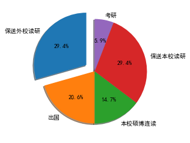
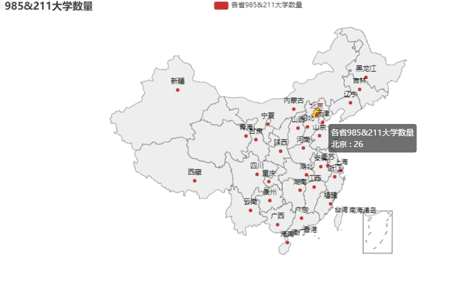
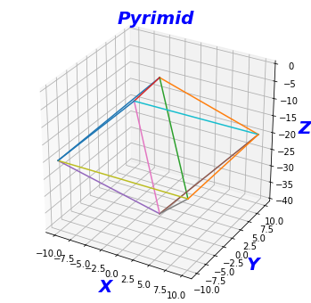

## Python-数据可视化2
- 班级: 2017211314
- 学号: 2017213508
- 学生: 蒋雪枫
- gif截图附后

### 作业8


```python
import matplotlib.pyplot as plt
import matplotlib
from matplotlib import font_manager as fm
matplotlib.rcParams['font.sans-serif'] = ['SimHei'] #支持中文的细黑体
label_list = ["保送外校读研","出国", "本校硕博连读","保送本校读研","考研"] 
# 各部分标签
size = [100,70,50,100,20] # 各部分的人数
explode = [0.2, 0, 0,0,0] # 各部分的突出显示比例
patches, texts, autotexts= plt.pie(size, explode=explode, labels=label_list, 
labeldistance=1.1, autopct="%1.1f%%", shadow=True, startangle=90,
pctdistance=0.6)
plt.show()
proptease = fm.FontProperties()
proptease.set_size('medium')
# plt.angle(90)
# font size include: ‘xx-small’,x-small’,'small’,'medium’,‘large’,‘x-large’,‘xx-large’ or number, e.g. '12'
plt.setp(texts, fontproperties=proptease)
plt.setp(autotexts, fontproperties=proptease)
plt.show()
```





### 作业9


```python
from pyecharts import options as opts
from pyecharts.charts import Map
import random
class Data:
    provinces = ["湖北", "广东", "北京", "上海", "江西", "河南", "浙江", "江苏",
    "湖南", "广西", "山东", "陕西", "山西", "河北", "福建", "黑龙江",
    "新疆", "西藏", "云南", "贵州", "四川", "宁夏", "吉林",
    "青海", "甘肃", "内蒙古", "重庆", "安徽","天津","海南","辽宁"]
    @staticmethod
    def values() -> list:
        return [1,4,26,9,1,1,1,11,3,1,3,1,1,0,2,4,2,1,1,1,5,1,3,1,1,1,2,3,4,1,4]
def map1() -> Map:
    c = (
        Map()
        .add("各省985&211大学数量", [list(z) for z in zip(Data.provinces, Data.values())], "china")
        .set_global_opts(title_opts=opts.TitleOpts(title="985&211大学数量"))
)
    return c
map1().render("map3.html")
```


    'C:\\Users\\Administrator\\Desktop\\Algorithm\\PythonHomework\\matplotlib\\map3.html'




### 作业10


```python
from pyecharts import options as opts
from pyecharts.charts import Geo
from pyecharts.globals import ChartType
from pyecharts.render import make_snapshot
from snapshot_phantomjs import snapshot
from PIL import Image
import imageio
import numpy as np
import random

class Data:
    sichuan_city = ['成都市', '绵阳市', '自贡市', '攀枝花市', '泸州市',
    '德阳市', '广元市', '遂宁市', '内江市', '乐山市', '资阳市', '宜宾市',
    '南充市', '达州市', '雅安市', '阿坝藏族羌族自治州', '甘孜藏族自治州',
    '凉山彝族自治州', '广安市', '巴中市', '眉山市'] 

    @staticmethod
    def values(start: int = 30, end: int = 40) -> list:
        return [random.randint(start, end) for _ in range(21)]

def geo_sichuan(title) -> Geo:
    c = (
        Geo()
        .add_schema(maptype='四川')
        .add(
            title, [list(z) for z in zip(Data.sichuan_city, Data.values())],
            type_=ChartType.HEATMAP)
        .set_global_opts(
            visualmap_opts=opts.VisualMapOpts(max_=42, is_piecewise=True),
            title_opts=opts.TitleOpts(title='四川温度变化情况')
        )
    )
    return c
days = 31
# 生成8月31天的数据
for i in range(days):
    print('Write %d.png' % (i + 1))
    title = '8月' + str(i + 1) + '日'
    make_snapshot(snapshot, geo_sichuan(title).render(),
    'Pictures\\' + str(i + 1) + '.png', pixel_ratio=2)

# 将生成的图片组合成为GIF
print('Write Gif')
pngs = ['Pictures\\' + str(i + 1) + '.png' for i in range(days)]
frames = []
# 消除背景黑色，设置为透明
mask = Image.new("RGBA",(1800, 1000), (255, 255, 255, 0))
for image in pngs:
    frame = Image.open(image)
    f = frame.copy().convert("RGBA")
    frames.append(Image.alpha_composite(mask, f))

img = Image.new("RGBA", frame.size, (255, 255, 255, 0))
img.save("temp.gif", save_all=True, append_images=frames, duration=0.1, loop=0)

```

    Write 1.png
    Write 2.png
    Write 3.png
    Write 4.png
    Write 5.png
    Write 6.png
    Write 7.png
    Write 8.png
    Write 9.png
    Write 10.png
    Write 11.png
    Write 12.png
    Write 13.png
    Write 14.png
    Write 15.png
    Write 16.png
    Write 17.png
    Write 18.png
    Write 19.png
    Write 20.png
    Write 21.png
    Write 22.png
    Write 23.png
    Write 24.png
    Write 25.png
    Write 26.png
    Write 27.png
    Write 28.png
    Write 29.png
    Write 30.png
    Write 31.png
    Write Gif
    


### 作业 长方体BAR图


```python
import numpy as np
import matplotlib.pyplot as plt
from mpl_toolkits.mplot3d import Axes3D
 
 
# setup the figure and axes
fig=plt.figure(figsize=(8,10))
ax1=fig.add_subplot(111, projection='3d')
 
# fake data
_x=np.arange(5)
_y=np.arange(5)
_xx, _yy=np.meshgrid(_x, _y)
x, y=_xx.ravel(), _yy.ravel()

top=x*y
top=np.array([1,2,3,4,5,16,17,18,19,6,15,24,25,20,7,14,23,22,21,8,13,12,11,10,9])
print(type(top))
print(top)
bottom=np.zeros_like(top)
width=depth=1


ax1.bar3d(x, y, bottom, width, depth, top, shade=True)
ax1.set_title('Shaded')
 
 
plt.show()
```

    <class 'numpy.ndarray'>
    [ 1  2  3  4  5 16 17 18 19  6 15 24 25 20  7 14 23 22 21  8 13 12 11 10
      9]
    


### 作业11-1


```python
# -*- coding: utf-8 -*-
import numpy as np
import matplotlib as mpl
import matplotlib.pyplot as plt
from mpl_toolkits.mplot3d import Axes3D

mpl.rcParams['legend.fontsize'] = 20  # mpl模块载入的时候加载配置信息存储在rcParams变量中，rc_params_from_file()函数从文件加载配置信息

font = {
    'color': 'b',
    'style': 'oblique',
    'size': 20,
    'weight': 'bold'
}
fig = plt.figure(figsize=(6, 6))  #参数为图片大小
ax = fig.gca(projection='3d')  # get current axes，且坐标轴是3d的

# 准备数据
# theta = np.linspace(-10, 10, 100)  # 生成等差数列，[-8π,8π]，个数为100
# z = np.linspace(-10, 10, 100)  # [-2,2]容量为100的等差数列，这里的数量必须与theta保持一致，因为下面要做对应元素的运算
# r = z ** 2 + 1
# x = r * np.sin(theta)  # [-5,5]
# y = r * np.cos(theta)  # [-5,5]
x1=np.linspace(-10, 0, 100)
y1=np.linspace(-10, 0, 100)
x3=np.linspace(0,-10,100)#
x2=np.linspace(0, 10, 100)
y2=np.linspace(0, 10, 100)
y3=np.linspace(0,-10,100)
c1=[-10]*100
c2=[10]*100
z1=x1+y1
z2=-x2-y2
z3=x3+y3
z4=x3+y3
ax.set_xlabel("X", fontdict=font)
ax.set_ylabel("Y", fontdict=font)
ax.set_zlabel("Z", fontdict=font)
ax.set_title("Pyrimid", alpha=1, fontdict=font) #alpha参数指透明度transparent
ax.plot(x1, y1, z1)
ax.plot(x2, y2, z2)
ax.plot(x2, y3, z3)
ax.plot(x3, y2, z4)
ax.plot(x1+x2,c1,-20)
ax.plot(x1+x2,c2,-20)
ax.plot(c1,y1+y2,-20)
ax.plot(c2,y1+y2,-20)
# ax.legend(loc='upper right') #legend的位置可选：upper right/left/center,lower right/left/center,right,left,center,best等等

plt.show()
```


### 作业11-2


```python
# -*- coding: utf-8 -*-

mpl.rcParams['legend.fontsize'] = 20  # mpl模块载入的时候加载配置信息存储在rcParams变量中，rc_params_from_file()函数从文件加载配置信息

font = {
    'color': 'b',
    'style': 'oblique',
    'size': 20,
    'weight': 'bold'
}
fig = plt.figure(figsize=(6, 6))  #参数为图片大小
ax = fig.gca(projection='3d')  # get current axes，且坐标轴是3d的

# 准备数据
# theta = np.linspace(-10, 10, 100)  # 生成等差数列，[-8π,8π]，个数为100
# z = np.linspace(-10, 10, 100)  # [-2,2]容量为100的等差数列，这里的数量必须与theta保持一致，因为下面要做对应元素的运算
# r = z ** 2 + 1
# x = r * np.sin(theta)  # [-5,5]
# y = r * np.cos(theta)  # [-5,5]
x1=np.linspace(-10, 0, 100)
y1=np.linspace(-10, 0, 100)
x3=np.linspace(0,-10,100)#
x2=np.linspace(0, 10, 100)
x4=np.linspace(10,0,100)
y2=np.linspace(0, 10, 100)
y3=np.linspace(0,-10,100)
y4=np.linspace(10,0,100)
y5=np.linspace(0,-10,100)
c1=[-10]*100
c2=[10]*100
z1=x1+y1
z2=-x2-y2
z3=x3+y3
z4=x3+y3

z5=-x2-y2-20
z6=x1+y1-20
z7=x3+y3-20
z8=x3+y3-20
ax.set_xlabel("X", fontdict=font)
ax.set_ylabel("Y", fontdict=font)
ax.set_zlabel("Z", fontdict=font)
ax.set_title("Pyrimid", alpha=1, fontdict=font) #alpha参数指透明度transparent
ax.plot(x1, y1, z1)
ax.plot(x2, y2, z2)
ax.plot(x2, y3, z3)
ax.plot(x3, y2, z4)

ax.plot(x1, y1, z5)
ax.plot(x2, y2, z6)
ax.plot(x1, y4, z7)
ax.plot(x4, y1, z8)

ax.plot(x1+x2,c1,-20)
ax.plot(x1+x2,c2,-20)
ax.plot(c1,y1+y2,-20)
ax.plot(c2,y1+y2,-20)
# ax.legend(loc='upper right') #legend的位置可选：upper right/left/center,lower right/left/center,right,left,center,best等等

plt.show()
```





### 作业12


```python
import matplotlib.pyplot as plt
from mpl_toolkits.mplot3d import Axes3D
import numpy as np
fig = plt.figure()
ax = Axes3D(fig)
x=np.random.randint(-100,100,40)
y=np.random.randint(-100,100,40)
X, Y = np.meshgrid(x, y)
Z=X**2+Y**2 - 20000
plt.xlabel('x')
plt.ylabel('y')
ax.scatter(X, Y, Z,  cmap='rainbow')
ax.scatter(X, Y, -Z,  cmap='rainbow')
plt.show()
```


```python

```
